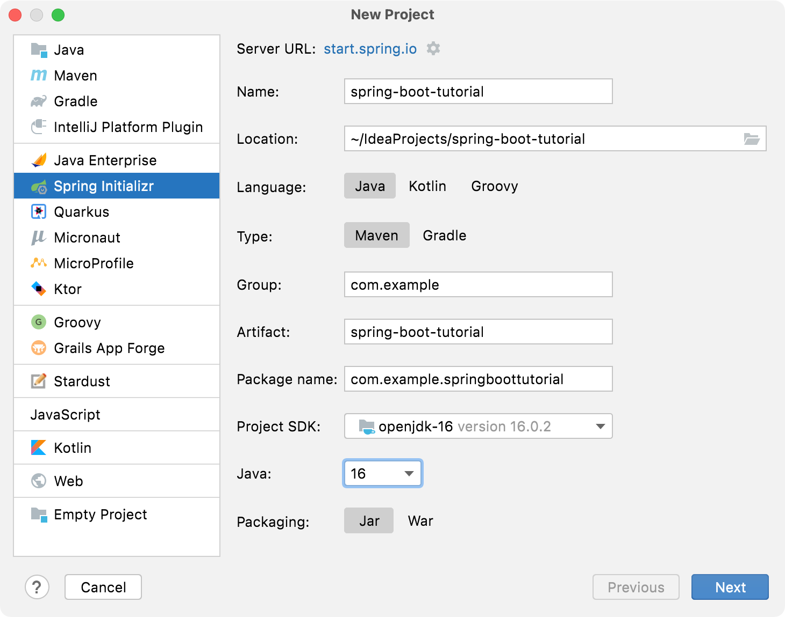
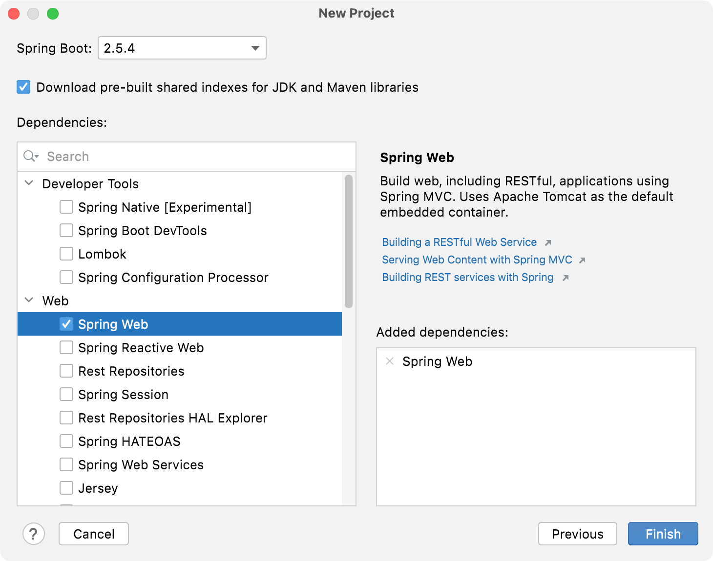

# Remote Lock or Unlock feature in Vehicle

Send remote commands to lock or unlock a vehicle

# Use cases

Need to create module which will send lock or unlock command to cloud to maintain the state of a car.

1) Send a lock or unlock command to cloud - 

   Steps:

       1) Validate if the VIN is valid by calling the API -  {Host}/api/v1/isValidVehicle/{VIN}
       2) Check if the Vehicle connectivity(TCU) is enabled by calling the API-  {Host}/api/v1/isTCUEnabled/{VIN}
       3) Validate if the Remote Lock/Unlock (RLUL) feature is available in the vehicle by calling the API - {Host}/api/v1/isValidFeature/{VIN}/RLUL
       4) If the vehicle supports RLUL, Lock/unlock the vehicle based on the command issued
       5) Update the status to the master API - {Host}/updateLockStatus/{VIN}/{COMMAND}
       6) If success, persist the same event entry in history for Audit


2) Lock/Unlock history

   Steps:

       1) Return the history of the vehicle lock status based on the audit
       2) Order the result in descending order and return response


# Creating Spring boot Application

# Spring Initializr

You can use this pre-initialized project and click Generate to download a ZIP file. This project is configured to fit the examples in this tutorial.
To manually initialize the project:
1) Navigate to https://start.spring.io. This service pulls in all the dependencies you need for an application and does most of the setup for you.
2) Choose either Gradle or Maven and the language you want to use. This guide assumes that you chose Java. 
3) Click Dependencies and select Spring Web.
4) Click Generate. 
5) Download the resulting ZIP file, which is an archive of a web application that is configured with your choices.
      If your IDE has the Spring Initializr integration, you can complete this process from your IDE.
      You can also fork the project from Github and open it in your IDE or other editor.

# Intellij 

1) From the main menu, select File | New | Project.
2) In the left pane of the New Project wizard, select Spring Initializr.
3) Specify a name for the project: spring-boot-tutorial. 
   From the Project SDK list, select Download JDK and download the latest version of Oracle OpenJDK (as of writing this tutorial, it was version 16.0.2). 

Select the latest Java version.



Click Next to continue.

4) Select the Spring Web dependency under Web. This dependency is required for any web application that uses Spring MVC.



Click Finish to generate and set up the project.

# Java Setup

Check if Java installed in the machine

```
java -version
openjdk version "1.8.0_292"
OpenJDK Runtime Environment Corretto-8.292.10.1 (build 1.8.0_292-b10)
OpenJDK 64-Bit Server VM Corretto-8.292.10.1 (build 25.292-b10, mixed mode)
```


# Maven Setup

Check if maven installed in the machine

```
mvn -v
Apache Maven 3.5.4 (1edded0938998edf8bf061f1ceb3cfdeccf443fe; 2018-06-17T14:33:14-04:00)
Maven home: /usr/local/Cellar/maven/3.3.9/libexec
Java version: 1.8.0_102, vendor: Oracle Corporation
```

## Useful Maven commands

The project makes use of Gradle and uses the Gradle wrapper to help you out carrying some common tasks such as building
the project or running it.

### Clean Project 

cleans the maven project by deleting the target directory.

```console
$ ./mvn clean
```

### Compile Source

Compiles the project, runs the test and then creates an executable JAR file

```console
$ ./mvn compiler:compile
```
###  Package 

Builds the maven project and packages them into a JAR, WAR, etc.

```console
$ ./mvn package
```

### Install

Builds the maven project and installs the project files (JAR, WAR, pom.xml, etc) to the local repository.

```console
$ ./mvn package
```

### Run Test cases

Run the unit test cases in application

```console
$ ./mvn test
```

### Start Application

To Start the Spring boot application

```console
$ ./mvn spring-boot:run
```

## APIs to implement

### 1)  Issue Remote commands to Vehicle

Endpoint

```text
PUT /api/command/{VIN}/{status}
```
Parameters

| Parameter    | Description    |
|--------------|----------------|
| `VIN`        | Vehicle Identification Number 			 |
| `lockStatus` | Lock status			 |

Retrieving readings using CURL

```console
$ curl "http://localhost:8080/api/command/LOCK"
```

Example output

This service should return "Success" or "Failure" based on the lock status.


### 2) Get Vehicle Lock History

Endpoint

```text
GET /api/vehicle-lock-history/{VIN}
```

Parameters

| Parameter      | Description                                           |
| -------------- | ----------------------------------------------------- |
| `VIN`          | Vehicle Identification Number                         |

Example response


```json
[
   {

      "command": "Lock",
      "status": "Success",
      "timestamp": "2020-11-29T08:00:00Z"
   },
   {
      "command": "Unlock",
      "status": "Success",
      "timestamp": "2020-11-29T08:00:00Z"
   }
]
```


# Guidelines

1) Follow the Java coding standards
2) Use H2 in memory DB for storing the data
3) Write unit testcases for all the classes/methods
4) Write comments wherever required
