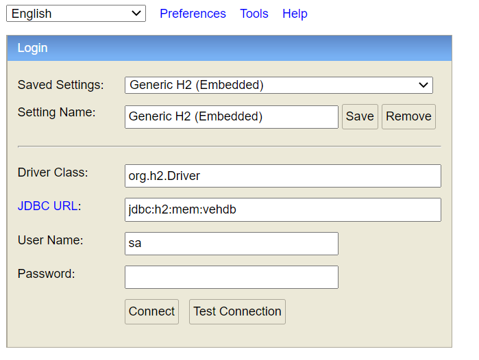
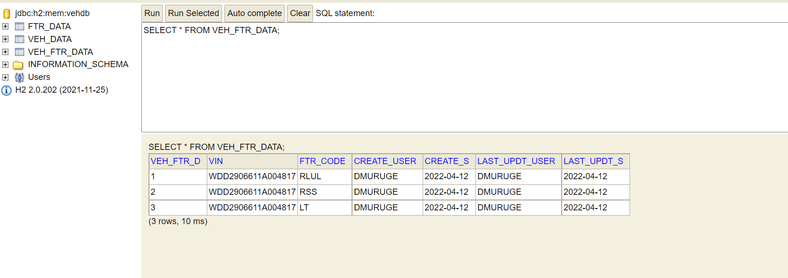

# Vehicle data provider

This application has set of API which exposes the vehicle data and its features

# APIs

# 1) Get All Vehicle Data

We can get the vehicle data and feature data by calling the below APIs

**GET {host}/api/v1/getAllVehicles**

``` Sample JSON Output
[
    {
        "purchaseDate": "2022-03-12",
        "lastServiceDate": "2022-03-12",
        "model": "GLA",
        "color": "White",
        "isTCUEnabled": "Y",
        "createdUser": "DMURUGE",
        "createdDate": "2022-04-12",
        "lastUpdatedUser": "DMURUGE",
        "lastUpdatedDate": "2022-04-12",
        "vin": "WDD2906611A004817",
        "ownerName": "Bob"
    },
    {
        "purchaseDate": "2021-01-20",
        "lastServiceDate": "2022-03-12",
        "model": "GLA",
        "color": "White",
        "isTCUEnabled": "Y",
        "createdUser": "DMURUGE",
        "createdDate": "2022-04-12",
        "lastUpdatedUser": "DMURUGE",
        "lastUpdatedDate": "2022-04-12",
        "vin": "WDD2906611A004818",
        "ownerName": "Peter"
    },
    {
        "purchaseDate": "2021-01-20",
        "lastServiceDate": "2022-03-12",
        "model": "GLC",
        "color": "White",
        "isTCUEnabled": "Y",
        "createdUser": "DMURUGE",
        "createdDate": "2022-04-12",
        "lastUpdatedUser": "DMURUGE",
        "lastUpdatedDate": "2022-04-12",
        "vin": "WDD2906611A004819",
        "ownerName": "Mike"
    },
    {
        "purchaseDate": "2021-01-20",
        "lastServiceDate": "2022-03-12",
        "model": "GLE",
        "color": "White",
        "isTCUEnabled": "Y",
        "createdUser": "DMURUGE",
        "createdDate": "2022-04-12",
        "lastUpdatedUser": "DMURUGE",
        "lastUpdatedDate": "2022-04-12",
        "vin": "WDD2906611A004820",
        "ownerName": "Rose"
    },
    {
        "purchaseDate": "2021-01-20",
        "lastServiceDate": "2022-03-12",
        "model": "EqC",
        "color": "White",
        "isTCUEnabled": "Y",
        "createdUser": "DMURUGE",
        "createdDate": "2022-04-12",
        "lastUpdatedUser": "DMURUGE",
        "lastUpdatedDate": "2022-04-12",
        "vin": "WDD2906611A004821",
        "ownerName": "Alice"
    }
]
```
# 2) Get Vehicle by VIN

We can validate Vehicle Data by using the below API

**GET {host}/api/v1/isValidVehicle/{VIN}**

``` Sample JSON Output
{
    "valid": false,
    "vin": "WDD2906611A004822"
}
```

# 3) Get All Feature Data

We can get all the vehicle features by calling the below API

**GET {host}/api/v1/getAllFeatures**

| Feature Code      | Description                              |
| --------------    | ---------------------------------------- |
|    RLUL           | Remote Lock/Unlock			           |
|    RSS            | Remote Start/Stop 			           |
|    LT             | Live Traffic       			           |
|    WIFI           | Wifi Hotspot			                   |
|    PA             | Parking assistance			           |
|    FSA            | Fuel Station assistance    	           |
|    VA             | Voice assistance          	           |


``` Sample JSON Output
[
    {
        "featureCode": "RLUL",
        "featureDesc": "Remote Lock/Unlock",
        "createdUser": "DMURUGE",
        "createdDate": "2022-04-12",
        "lastUpdatedUser": "DMURUGE",
        "lastUpdatedDate": "2022-04-12"
    },
    {
        "featureCode": "RSS",
        "featureDesc": "Remote Start/Stop",
        "createdUser": "DMURUGE",
        "createdDate": "2022-04-12",
        "lastUpdatedUser": "DMURUGE",
        "lastUpdatedDate": "2022-04-12"
    },
    {
        "featureCode": "LT",
        "featureDesc": "Live Traffic",
        "createdUser": "DMURUGE",
        "createdDate": "2022-04-12",
        "lastUpdatedUser": "DMURUGE",
        "lastUpdatedDate": "2022-04-12"
    },
    {
        "featureCode": "WIFI",
        "featureDesc": "Wifi Hotspot",
        "createdUser": "DMURUGE",
        "createdDate": "2022-04-12",
        "lastUpdatedUser": "DMURUGE",
        "lastUpdatedDate": "2022-04-12"
    },
    {
        "featureCode": "PA",
        "featureDesc": "Parking assistance",
        "createdUser": "DMURUGE",
        "createdDate": "2022-04-12",
        "lastUpdatedUser": "DMURUGE",
        "lastUpdatedDate": "2022-04-12"
    },
    {
        "featureCode": "FSA",
        "featureDesc": "Fuel Station assistance",
        "createdUser": "DMURUGE",
        "createdDate": "2022-04-12",
        "lastUpdatedUser": "DMURUGE",
        "lastUpdatedDate": "2022-04-12"
    },
    {
        "featureCode": "VA",
        "featureDesc": "Voice assistance",
        "createdUser": "DMURUGE",
        "createdDate": "2022-04-12",
        "lastUpdatedUser": "DMURUGE",
        "lastUpdatedDate": "2022-04-12"
    }
]
```

# 4) Validate Feature of a vehicle

We can validate Vehicle Data by using the below API

**GET {host}/api/v1/isValidFeature/{VIN}/{FtrCode}**

``` Sample JSON Output
{
    "featureCode": "RLUL",
    "valid": false,
    "vin": "WDD2906611A004822"
}
```

# 5) Get current Lock status of a Vehicle

We can get the current state of a CAR. whether it is locked or unlocked

## End point

**GET {host}/api/v1/lockStatus/{VIN}**

``` Sample JSON Output
{
    "isLocked": "Y",
    "createdUser": "DMURUGE",
    "createdDate": "2022-04-12",
    "lastUpdatedUser": "DMURUGE",
    "lastUpdatedDate": "2022-04-12",
    "vin": "WDD2906611A004817"
}
```
# 5) Get current Lock status of a Vehicle

We can get the current state of a CAR. whether it is locked or unlocked

## End point

**GET {host}/api/v1/lockStatus/{VIN}**

``` Sample JSON Output
{
    "isLocked": "Y",
    "createdUser": "DMURUGE",
    "createdDate": "2022-04-12",
    "lastUpdatedUser": "DMURUGE",
    "lastUpdatedDate": "2022-04-12",
    "vin": "WDD2906611A004817"
}
```

## Database

In-memory H2 database

Define schema by creating a SQL file (schema.sql) in the resource folder (src/main/resource).
Define data for tables by creating a SQL file (data.sql) in the resource folder (src/main/resource).

To enable H2 console add the below line in application.properties
```
spring.h2.console.enabled=true
```
We can view the H2 console by entering the URL - http://localhost:<port>/h2-console






#Table Name: VEH_DATA

| COLUMN        	   | TYPE        	   | DESC                            |
| --------------   	   | --------------    | --------------------------------|
| `VIN`           	   |  VARCHAR(17)      | Vehicle Identification Number   |
| `OWNER_NAME`         |  VARCHAR(100)     | Owner of the vehicle            |
| `PURCHASE_DATE`      |  DATE     	   	   | Purchase Date                   |
| `LAST_SERVICE_DATE`  |  DATE  	       | Last Service Date               |
| `MODEL`              |  VARCHAR(50)      | Model of the Vehicle            |
| `COLOR`              |  VARCHAR(10)      | Color of the Vehicle            |
| `IS_TCU_ENABLED`     |  VARCHAR(1)       | Purchase Date                   |
| `CREATE_USER`  	   |  VARCHAR(100)     | Created User                    |
| `CREATE_S`           |  DATE             | Created Date		             |
| `LAST_UPDT_USER`     |  VARCHAR(100)     | Last Updated User               |
| `LAST_UPDT_S`        |  DATE             | Last Updated TIme               |

# FTR_DATA

#Table Name: FTR_DATA

| COLUMN        	  | TYPE        	   | DESC                            |
|------------------| --------------    | --------------------------------|
| `FTR_CODE`       |  VARCHAR(10)      | Feature Code                    |
| `FTR_DESC`     	 |  VARCHAR(100)     | Feature Desc                    |
| `CREATE_USER`  	 |  VARCHAR(100)     | Created User                    |
| `CREATE_S`       |  DATE             | Created Date		             |
| `LAST_UPDT_USER` |  VARCHAR(100)     | Last Updated User               |
| `LAST_UPDT_S`    |  DATE             | Last Updated TIme               |


#Table Name: VEH_FTR_DATA

| COLUMN        	   | TYPE        	   | DESC                            |
| --------------   	   | --------------    | --------------------------------|
| `VIN`           	   |  VARCHAR(17)      | Vehicle Identification Number   |
| `FTR_CODE`           |  VARCHAR(10)      | Feature Code                    |
| `ACTIVATED_DT` 	   |  DATETIME  	   | Feature Activated Date          |
| `DE_ACTIVATED_DT`    |  DATETIME         | Model of the Vehicle            |
| `CREATE_USER`  	 |  VARCHAR(100)     | Created User                    |
| `CREATE_S`       |  DATE             | Created Date		             |
| `LAST_UPDT_USER` |  VARCHAR(100)     | Last Updated User               |
| `LAST_UPDT_S`    |  DATE             | Last Updated TIme               |


#Table Name: VEH_LOCK_STATUS

| COLUMN        	   | TYPE        	 | DESC                          |
| --------------   	   |---------------|-------------------------------|
| `VIN`           	   | VARCHAR(17)   | Vehicle Identification Number |
| `IS_LOCKED`           | VARCHAR(1)    | Vehicle Current Lock Status   |
| `CREATE_USER`  	 | VARCHAR(100)  | Created User                  |
| `CREATE_S`       | DATE          | Created Date		                |
| `LAST_UPDT_USER` | VARCHAR(100)  | Last Updated User             |
| `LAST_UPDT_S`    | DATE          | Last Updated TIme             |
